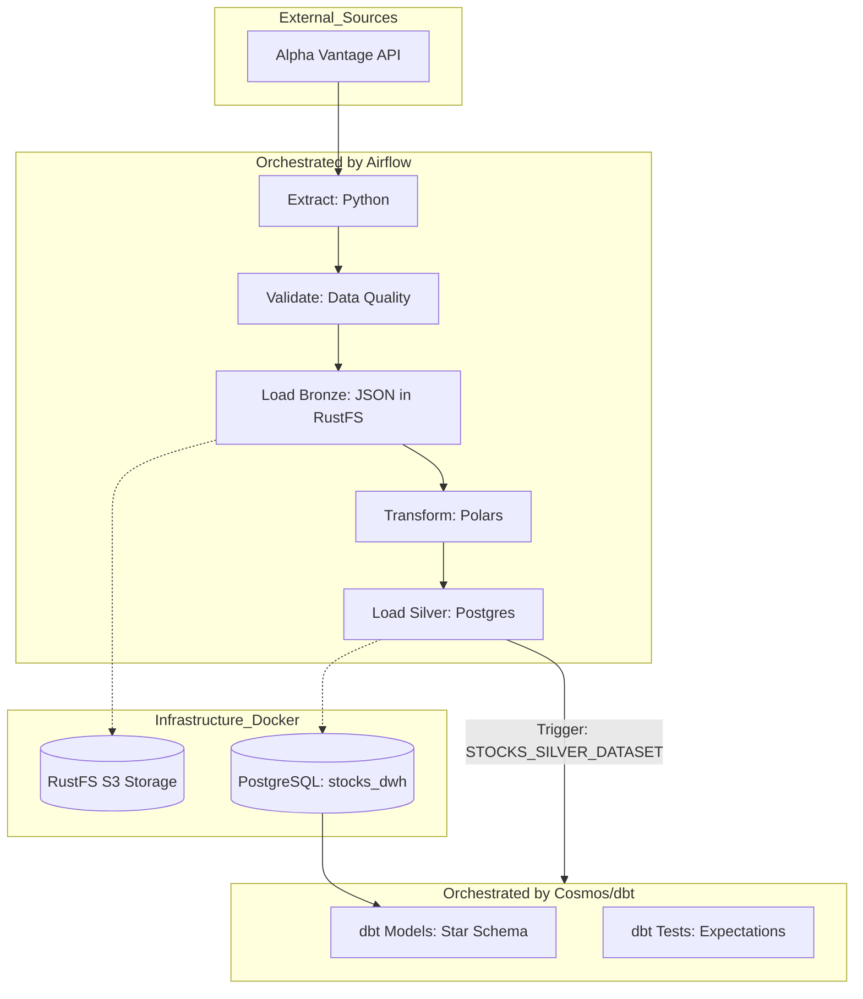

# 📈 ELT Pipeline for Stock Market Analysis (Batch) - Dimensional Data Warehouse

## 📄 Project Overview and Summary

This project implements a robust and modular **ELT (Extract, Load, Transform) Pipeline** designed to ingest, clean, and model stock price data into a **Dimensional Data Warehouse (Star Schema)**.

The solution leverages the popular integration of **Apache Airflow**, **dbt**, and **Cosmos** for reliable orchestration and high-quality data transformations. The focus is on **Batch Processing**, utilizing industry-leading tools to ensure data quality and performance in preparing information ready for consumption by Business Intelligence (BI) tools.

## 🎯 Objective and Architecture

### 🏗 Data Pipeline Architecture

