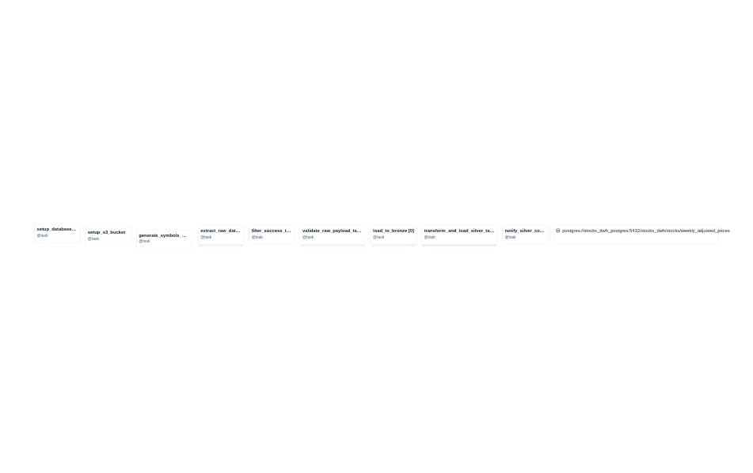
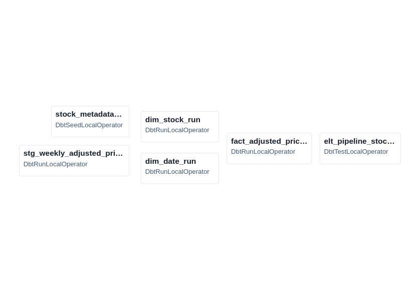
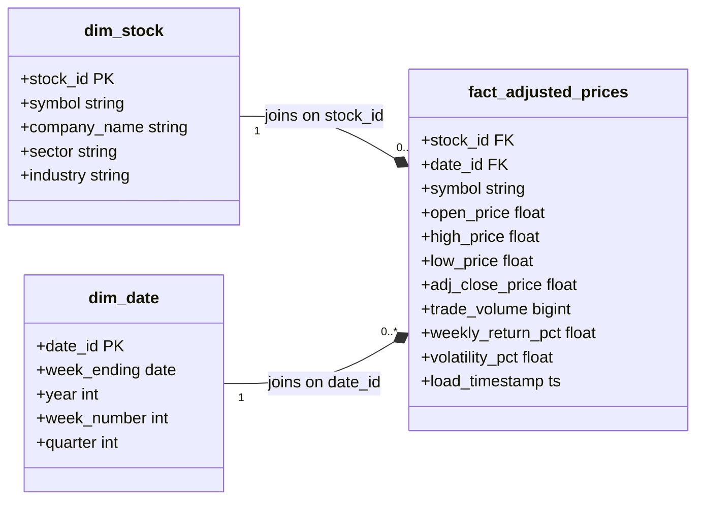

# Stocks Analytics ELT Pipeline

## Objective

This project implements an end-to-end data pipeline to process financial time-series data from the **Alpha Vantage API** and visualize key market insights. It demonstrates proficiency in modern, high-performance tools such as **Polars** (Rust-backed processing), **Apache Airflow**, and **dbt**, following a local-to-cloud-ready architecture.

## Problem Statement

Raw data from financial APIs like Alpha Vantage is suboptimal and incomplete for the rigorous requirements of an OLAP Data Warehouse. The data arrives in deeply nested, rate-limited JSON structures that lack the relational integrity and historical consistency needed for complex Business Intelligence. Without a structured modeling layer, performing multi-ticker comparisons, volatility benchmarking, or time-series aggregations becomes computationally expensive and architecturally brittle.

## The solution

This project aims to transforms volatile API extracts into a robust, analytical environment using Dimensional Modeling.
By architecting a Star Schema, we transition from raw "point-in-time" data to a structured Gold Layer.
This facilitates high-performance analytical queries, allowing for sub-second aggregations and deep-dive slicing and dicing of market trends that would be impossible with the raw source data.

The goal is to create a robust data pipeline capable of handling rate-limited financial APIs and transforming messy JSON responses into an optimized Star Schema. The pipeline provides actionable insights through a **Streamlit dashboard** with visualizations including:

- **Categorical Distribution**: Sector performance and dividend frequency across different stock tickers.
- **Temporal Distribution**: Weekly adjusted price trends and price volatility metrics over a 52-week period.

## Dataset

The dataset is sourced from the **Alpha Vantage API**, specifically focusing on **Weekly Adjusted Stock Intelligence**.

- **Source**: [Alpha Vantage Stock API](https://www.alphavantage.co/)
- **Data Points**: Historical weekly open, high, low, close, adjusted close, volume, and dividend amounts.
- **Metadata**: Global ticker symbols mapped dynamically through Airflow task expansion.

## 🏗️ Architecture & Design

The project implements a **Medallion Architecture** designed for **batch processing**.
This approach was chosen because the source financial data is updated on a weekly schedule, allowing for high-performance transformations and optimized resource usage without the overhead of real-time streaming.


The pipeline leverages Python (Polars) as the high-speed processing engine, orchestrating data movement from S3 to Postgres with a memory-efficient, Arrow-native approach.

### 1. 󱘨 Bronze (Raw Landing Zone)

- Bronze (Immutable Data Lake): Implemented to decouple API ingestion from transformation. This architecture prevents vendor rate-limit exhaustion during backfilling or schema evolution; we can re-process historical weeks from the local S3-compatible storage without re-triggering Alpha Vantage credits, effectively creating an idempotent recovery boundary.
- **Concept**: **Immutable Data Lake**.
- **Action**: Automated ingestion of Alpha Vantage JSON payloads into **RustFS (S3-compatible)**.
- **Role**: Serves as the **Single Source of Truth (SSOT)**. By persisting raw data, we ensure **idempotency** and recoverability, eliminating the need for redundant API calls during re-runs.

### 2. 󱘩 Silver (Normalized / Staging)

- **Concept**: Schema Enforcement & Data Cleaning.
- **Engine**: **Polars** (Rust-backed processing) utilizing Arrow-native memory management.
- **Orchestration:** Implemented via Airflow TaskFlow API with Dynamic Task Mapping to process multiple tickers in parallel.



- **Performance Highlights**:
  - **Memory Efficiency**: Utilizes Arrow-native memory management to process financial time-series with zero-copy overhead.
  - **Parallelism**: Leverages multi-core parallelism for JSON flattening, outperforming traditional Pandas-based workflows by **5x-10x** in high-concurrency mapped tasks.
- **Field Work**:
  - **Type Casting**: Precise financial type enforcement (Decimal/Float64).
  - **Deduplication**: Strategic transactional integrity checks before DWH ingestion.

### 3.  Gold (Analytical / OLAP Layer)

- **Concept**: **Dimensional Modeling (Star Schema)**.
- **Engine**: **dbt (Data Build Tool)**.
- **Implementation & Field Work**:
  - **Star Schema Design**: Transformation of staging models into a central `fact_adjusted_prices` table
  - **Dimension Strategy**: Implemented **SCD Type 1 logic** for `dim_stock` to maintain a streamlined, single-version-of-truth for descriptive attributes (Sector, Industry), optimizing JOIN performance for the BI layer.
  - **Surrogate Keys**: Utilization of `dbt_utils.generate_surrogate_key` to decouple business keys (symbols) from data warehouse internal logic, ensuring relational integrity.
  - **Data Quality Framework**:
    - **Contract Enforcement**: Utilizing `dbt-expectations` to validate ticker regex formats (`^[A-Z0-9\.]+$`) and non-negative financial ranges.
    - **Referential Integrity**: Automated tests to ensure every `fact_key` maps correctly to `dim_stock` and `dim_date`, preventing orphaned records in the Star Schema.
    - **Materialization Strategy**: Incremental materialization logic to optimize warehouse storage and compute costs.
- **Orchestration**: Integration via **Astronomer Cosmos**, which dynamically parses the dbt project and renders it as a native Airflow Task Group, providing granular retry logic and metadata visibility for each model.



### 4. 🛠️ Infrastructure & DevOps

- **Containerization** & **Environment**: The entire stack is containerized using **Podman/Docker**, ensuring environment parity from development to deployment via `docker-compose.override.yml`.
- **Orchestration**: **Apache Airflow (Astronomer)** manages the end-to-end workflow.
- **Integration**: **Astronomer Cosmos** renders dbt models as native Airflow task groups, ensuring granular retries and full data lineage visibility.
- **CLI-First Workflow**: Managed via a custom `Makefile` and `astro-cli`, optimizing developer experience (DX) and pipeline reproducibility.
- **Development Environment**: Built and tested on **Linux**, leveraging shell scripting and environment-based configurations for secure credential management.

### 🛡️ Network & Access (Chisel Tunneling)

To simulate a professional environment where the BI layer might reside in a private network, I implemented **Chisel**. This creates a secure TCP tunnel that exposes the **Streamlit** dashboard port, applying container networking and secure data delivery.

## Technologies Used

- **Orchestration**: Apache Airflow (via Astro CLI)
- **Workflow Integration**: Astronomer Cosmos (dbt-Airflow integration)
- **Data Lake (S3 API)**: RustFS (Local S3-compatible storage)
- **Data Processing Engine**: Polars (Rust-based DataFrames)
- **Data Transformation**: dbt (Data Build Tool)
- **Data Warehouse**: PostgreSQL
- **Business Intelligence / Visualization**: Streamlit
- **Language**: Python (for Extraction, Polars, and Airflow DAGs)
- **Dependency Management**: `uv` (Ultra-fast Python package manager)

## 📉 Data Modeling

I implemented a **Star Schema** to optimize query performance and ensure clear separation between business entities and quantitative events.



## 📊 Business Intelligence & Data Consumption

While the core of this project is Engineering, data is useless if it cannot be consumed. So, i built a custom **BI-as-Code** dashboard using **Streamlit** to validate the final Gold Layer.

- **Why Streamlit (BI-as-Code)?**

- Choosing Streamlit over drag-and-drop tools allows for a unified type-system across the stack. By using Polars + ConnectorX as the backend, the dashboard operates on the same Apache Arrow memory format as the Silver Layer, eliminating serialization overhead and ensuring that complex analytical calculations (like Z-Scores) are offloaded to the high-performance Polars engine instead of the visualization layer.

- **Star Schema Validation**: The UI performs real-time JOINs between `fact_adjusted_prices` and dimensions, proving the DWH structure is sound.

- **High-Performance Fetching**: Powered by **Polars + ConnectorX**, data is streamed from Postgres using the **Apache Arrow** format, bypassing the overhead of traditional Row-based processing.

- **Data Lineage Audit**: Each visual displays the `execution_batch_id` from the latest Airflow run, ensuring full traceability from API to Chart.

## 🚀 Pipeline Observability & Performance

I implemented a dual-layer monitoring strategy to ensure both data integrity and system efficiency.

### 1. Memory Efficiency Audit (`audit_mem.py`)

To justify the choice of **Polars** over Pandas for high-frequency financial data, I included a benchmarking suite. Since Polars is built on Rust and uses **Apache Arrow**, it manages memory mapping with zero-copy overhead where possible.

- **Performance Gap:** My audits show that Polars maintains a significantly lower memory footprint during the "Silver to Gold" transition.
- **Automated Validation:** The `test_memory_efficiency` script (integrated into the CI/CD mindset) ensures that any future refactoring does not exceed established memory thresholds.

### 2. Multi-Stage Data Validation (Data Quality Checks)

Data quality is enforced at three critical checkpoints to prevent "silent failures":

- **Bronze (JSON Schema):** The `validate_raw_payload` logic catches API rate limits, "Information" messages from Alpha Vantage, and malformed JSON before they are persisted.
- **Silver (Schema Enforcement):** Polars enforces strict typing (Float64, Int64, Date) and performs "logical pruning" (filtering out non-finite prices or zero volumes).
- **Gold (Relational Integrity):** Through **dbt tests**, the pipeline validates the Star Schema, ensuring every record in `fact_adjusted_prices` has a valid corresponding entry in `dim_stock` and `dim_date`.

### 3. Execution Traceability & Lineage

Every record in the Warehouse is fully auditable through metadata columns:

- load_timestamp: Ensures full auditability of when data entered the warehouse, enabling precise point-in-time recovery and batch tracking.

## Evaluation Criteria Checklist

This project meets the requirements outlined in professional Data Engineering standards:

- ✅ **Problem description**: Clear objective to process financial data using a high-performance ELT stack.
- ✅ **Cloud Readiness**: Uses S3-compatible storage (RustFS) and containerization, making it ready for AWS/GCP migration.
- ✅ **Data ingestion (Batch)**: Implements an end-to-end batch pipeline with Airflow managing extractors and loaders.
- ✅ **Data warehouse**: PostgreSQL utilized as the Data Warehouse with an optimized Star Schema (Gold Layer).
- ✅ **Transformations**: Two-stage transformation using **Polars** (Silver) and **dbt** (Gold) for complex business logic.
- ✅ **Dashboard**: A Streamlit dashboard provides both categorical (ticker/sector) and temporal (price over time) visualizations.
- ✅ **Reproducibility**: Detailed steps provided using Astro CLI and Podman.

## Future Improvements (Optional)

While the core requirements are met, the following enhancements are planned for production-grade evolution:

- **Testing & Data Quality**:
  - Implement unit tests for Polars transformation logic using `pytest`.
  - Add data quality checks within dbt using `dbt-tests` or **Great Expectations**.
- **Automation & CI/CD**:
  - Set up **GitHub Actions** for automated linting and testing.
  - Containerize the Streamlit dashboard as a separate service.
- **Observability**:
  - Integrate **OpenLineage** to track data movement across Polars and dbt.
  - Integrate **Grafana** and Prometheus to monitor pipeline health.
  - Configure Slack/Discord notifications for DAG failures.
- **Infrastructure as Code (IaC)**:
  - **LocalStack Integration**: Transition from standalone RustFS to **LocalStack** to mock a full AWS environment (S3, Secrets Manager, and IAM) locally for production-parity testing.
  - Transition setup to **Terraform** for AWS or GCP provisioning.

## 🚀 Quick Start (Reproducibility)

This project is fully containerized and automated via **Makefile**.

### Prerequisites

- **Alpha Vantage API Key** [Get one here](https://www.alphavantage.co/support/#api-key).
- **Docker/Podman** & **Astro CLI**.
- Astronomer-Cosmos from dbt-on-astro Template (Optional)

### One-Command Setup

```bash
# 1. Clone and set up environment
git clone https://github.com/aner-dev/stocks-analytics-elt-pipeline.git
cd elt_pipeline_stocks
cp .env.example .env  # Add your API Key here

# 2. Spin up the entire stack (Postgres, Airflow, RustFS, Streamlit)
make up

# 3. Run Pipeline & Tests
make dbt-run
make dbt-test

# 4. View Analytics
make dashboard
```

#Developed by Aner Dev.

**Tech Stack:**


