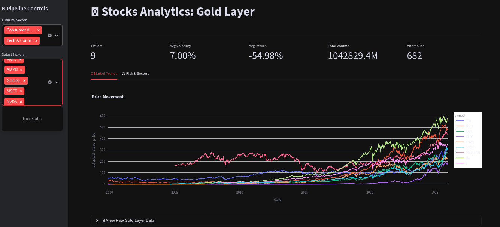
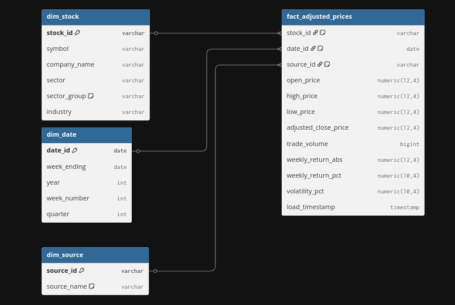
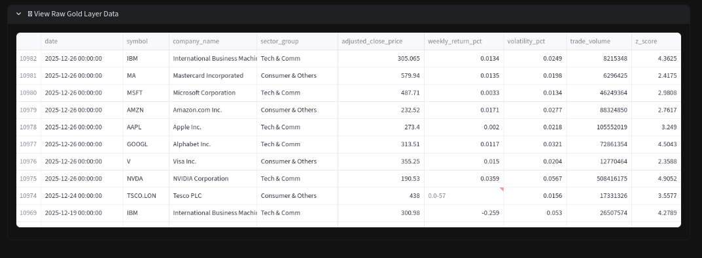
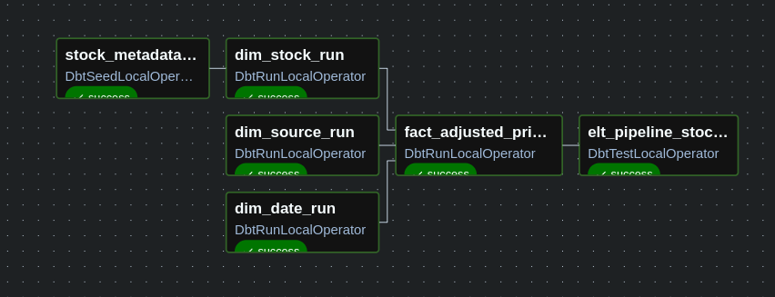

# 🚀 High-Performance Stocks Analytics ELT Pipeline

<div align="center">
  ** Modern Financial ELT Data Pipeline | Weekly Stocks Analytics OLAP **
</div>

______________________________________________________________________

## 📖 Table of Contents

- [🏗️ 1. Architecture & Design](#%EF%B8%8F-1-architecture--design)
- [📊 2. Business Intelligence & Dashboards](#-2-business-intelligence--dashboards)
- [📉 3. Data Modeling](#-3-data-modeling)
- [⚙️ 4. Orchestration](#%EF%B8%8F-4-orchestration)
- [📦 5. Infrastructure & Containerization](#5-infrastructure--containerization)
- [🛠️ 6. Tech Stack](#%EF%B8%8F-6-tech-stack)
- [🚀 7. Future Improvements](#-7-future-improvements)
- [🏁 8. Quick Start](#-quick-start)## 📖 Table of Contents
- [🏗️ 1. Architecture & Design](#%EF%B8%8F-1-architecture--design)
- [📊 2. Business Intelligence & Dashboards](#-2-business-intelligence--dashboards)
- [📉 3. Data Modeling](#-3-data-modeling)
- [⚙️ 4. Orchestration](#%EF%B8%8F-4-orchestration)
- [📦 5. Infrastructure & Containerization](#5-infrastructure--containerization)
- [🛠️ 6. Tech Stack](#%EF%B8%8F-6-tech-stack)
- [🚀 7. Future Improvements](#-7-future-improvements)
- [🏁 8. Quick Start](#-quick-start)

______________________________________________________________________

## 🏗️ 1. Architecture & Design

This project implements a **Medallion Architecture** designed for **Batch Processing**. It decouples weekly frequency data ingestion to analytical modeling (OLAP), ensuring idempotency and system resilience.


______________________________________________________________________

### ⚡ Key Engineering Insights

- **Engine: Polars (Rust-backed):** Selected over Pandas in order to leverage **Apache Arrow** and prioritizing efficient compute. This enables 10x faster JSON flattening and memory-efficient processing of weekly time-series data.
- **Orchestration: Airflow & Astronomer Cosmos:** Orchestrates the dbt project by parsing the `manifest.json` into native Airflow Task Groups, allowing for granular retry logic at the model level.
  - Parallelism: It uses **Dynamic Task Mapping** to process multiple stock tickers in parallel.
- **Storage: Immutable Bronze Layer:** Raw payloads are persisted in **RustFS (S3 API-compatible)**. This allows for historical backfills without exhausting Alpha Vantage API credits.
- **Data Quality:** Schema enforcement and referential integrity ensured via Polars (Silver Layer) and **dbt-expectations** (Gold Layer).

______________________________________________________________________

## 📊 2. Business Intelligence & Dashboards

**BI-As-Code**: Used **Streamlit + ConnectorX**, the dashboard bypasses slow row-based serialization, streaming data directly from Postgres in Arrow format.

<div align="center">

### Market Volatility & Price Trends


*52-week volatility metrics and adjusted close trends calculated at the Warehouse level.*

### Sector & Volume Distribution


*Categorical breakdown of market performance and liquidity.*

</div>

> **Tech Highlight:** The UI performs real-time JOINs between the Fact table and Dimensions, proving the Gold Layer is optimized for high-speed analytical slicing.

______________________________________________________________________

## 📉 3. Data Modeling

**Dimensional Modeling**: Implementation of a **Star Schema** optimized for OLAP workloads (Kimball approach)



### 🛠️ Data Modeling Implementation

**Star Schema**: Structured around a central Fact Table `(fact_adjusted_prices)` supported by three key dimensions: dim_stock (SCD Type 1), dim_date, and dim_source for full auditability.

**Surrogate Keys**: Generated via `dbt_utils.generate_surrogate_key` (MD5) to ensure relational integrity and decouple business keys from warehouse logic.

**Added Advanced Metrics**: The **Fact Table** features pre-calculated analytical fields, including Z-Scores, Weekly Returns, and Volatility Benchmarks.

<div align="center">

### Gold Layer Snapshot (Fact Table)



</div>

______________________________________________________________________

## ⚙️ 4. Orchestration

The Orchestration is managed by Apache Airflow and Astronomer
The pipeline utilizes a decoupled DAG strategy to separate high-concurrency ingestion from structural modeling.

### 🔄 Ingestion & Normalization (dag_silver_layer)

- Bronze (Extraction & Landing): Persists raw semi-structured JSON payloads into a RustFS bucket (S3 API compatible). This architecture design ensures high-durability and a allows a seamless path to a future **Cloud migration**.

- Silver (Staging & Cleansing): Raw data is transformed by **Polars** and loaded into a Postgres Database as the silver layer

  - by emitting a **Airflow Dataset** (STOCKS_SILVER_DATASET) the Gold Layer is reactively triggered only when the Silver Layer successfully commits new data.
  - This **event-driven** approach aims to provide an additional layer of resilience, ensuring that downstream modeling only occurs once data integrity is guaranteed in the silver layer.


<details> <summary>🔍 <b>Challenges & Decisions</b></summary>

#### Switching from Pandas to Polars

- The problem: Initially I used pandas to the Transformation phase. However, when processing multiple tickers in parallel, I noticed significant memory spikes and slow serialization when reading from the database.

* Testing & Discovery: I developed a utility script (audit_mem.py) using Polars to leverage ConnectorX and Arrow and compare memory footprints & performance. The audit confirmed that Pandas was creating heavy Python objects, while Polars has significant performance advantages over pandas.
  - see results and metrics in `scripts/audit_mem.py`

The Solution: Migrate to *Polars* as the transformation engine. This change not only dropped the memory usage but also made JSON flattening roughly 10x faster.

#### Event-Driven Orchestration

**The Problem:** Originally the pipeline rely on a full time-based scheduling (Cron). However if the data ingestion delayed due to API rate-limiting, the posterior data modeling would trigger on incomplete or stale data. Thus, creating a **tight coupling** risk

**The Solution:** I implemented **Data-Aware Scheduling** via **Airflow Datasets**. The Silver DAG now emits a `STOCKS_SILVER_DATASET` outlet.

- **Goal:** This ensures the Gold Layer is only triggered upon a successful data commit. This decision aims to strengthen pipeline resilience while eliminating the need for resource-heavy polling sensors.

</details>

### 🥇 Gold Layer (dag_gold_layer)



- Business Logic: I use *dbt* (data build tool) to calculate advanced metrics like Z-Scores and Volatility Benchmarks and for the DDL of the Star Schema & Dimensional Modeling.

* Data-Aware Scheduling: The DAG is event-driven; it only executes once the Silver dataset is successfully updated.

- **Data Integrity & Contracts:** Every run is followed by `dbt-expectations` tests. Enforcing referential integrity and schema validation. No "null" values or schema drifts reach the final Gold tables.
- **SCD Management:** Handles **Slowly Changing Dimensions (Type 1)** to maintain an accurate record of stock metadata.

<details> <summary>🔍 <b>Challenges & Decisions</b></summary>

</details>

## 5. Infrastructure & Containerization

The entire stack is containerized to ensure environment parity and simplified deployment. While developed using Podman and Astro CLI, it is fully compatible with Docker Compose.

<details> <summary>🔍 <b>Challenges & Decisions</b></summary>

🌐 Network Bottleneck (MTU Issue)
The Problem: For a few days I was unable to correctly implement the **Extraction phase**. The airflow logs reporting only generic connection resets without signaling the root cause.

The Cause: While using Podman, I discovered that their default virtual bridge network used an MTU (Maximum Transmission Unit) of 65,000 bytes!. This caused massive packet fragmentation when communicating with the Alpha Vantage external API.

The Solution: I manually defined a custom bridge network in `docker-compose.override.yml` with an MTU of 1500 bytes (the standard Ethernet limit). This immediately stabilized the API connection and extraction, proving that the bottleneck was in the infrastructure, not the code.

Verification: You can inspect your network's MTU settings using:

`podman network inspect airflow --format '{{index .options "com.docker.network.driver.mtu"}}'`

</details>

## 🛠️ 6. Tech Stack

| Category | Tools |
| :--- | :--- |
| **Language & Engine** | Python 3.11, **Polars**, Apache Arrow |
| **Orchestration** | Apache Airflow, Astronomer Cosmos |
| **Data Transformation** | **dbt (Core)**, dbt-expectations, dbt-utils |
| **Storage & DWH** | PostgreSQL, RustFS (S3-compatible API) |
| **BI/Visualization** | Streamlit |
| **Infrastructure** | Linux, Docker / Podman, Makefile, Git |

## 🚀 7. Future Improvements

- **Cloud Migration (IaC):** Transition from local RustFS to AWS S3 and Postgres to RDS/Snowflake using **Terraform**.

- **CI/CD Integration:** Implement GitHub Actions to automate dbt testing and linting (`sqlfluff`) on every Pull Request.

- **SCD Type 2 Implementation:** Transition from SCD Type 1 to Type 2 for `dim_stock` to track historical changes in sector or metadata.

- **Advanced Observability:** Integrate **Great Expectations** for data profiling and **OpenLineage** for end-to-end metadata tracking.

- **Monitoring & Observability:** Implement **Prometheus** and **Grafana** to monitor container health, CPU/Memory usage during Polars processing, and Airflow worker performance.

* **Alerting System:** Configure Slack or Discord notifications for DAG failures and dbt test breaches using Airflow Callbacks and Webhooks.

## 🚀 Quick Start

```bash
# 1. Clone & Environment Setup
cp .env.example .env  # Add your Alpha Vantage API Key

# 2. Spin up the Stack (Postgres, Airflow, RustFS, Streamlit)
make up

# 3. Execute Transformations & Tests
make dbt-run && make dbt-test
```
